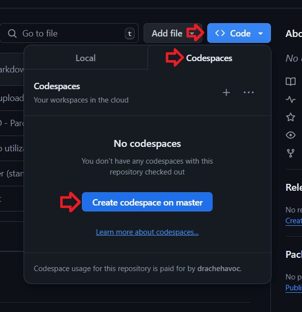
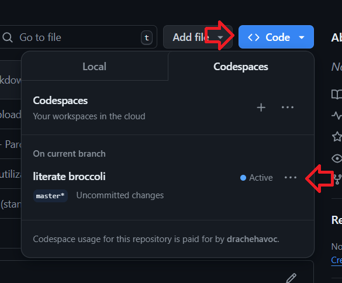

# Codespace como ambiente de desenvolvimento e testes

O codespace é uma ferramenta do GitHub que permite a criação de um ambiente de desenvolvimento e testes diretamente no navegador. Com ele é possível criar um ambiente de desenvolvimento com todas as ferramentas necessárias, como editores de código, terminal, git, etc.

Baseado no Visual Studio Code, o Codespace permite a execução de comandos no terminal, edição de arquivos, execução de testes, entre outras funcionalidades.

De maneira simploria trata-se de um ambiente de desenvolvimento em nuvem, onde o desenvolvedor pode acessar de qualquer lugar via browser, este ambiente roda em um container [Docker](https://www.docker.com/).

> ⚠️ **Atenção**
> 
> 1. Este tutorial tem o objetivo de apresentar o Codespace como ferramenta de desenvolvimento e testes, não é um tutorial completo sobre o Codespace, para saber mais sobre o Codespace, consulte a [documentação oficial](https://docs.github.com/pt/codespaces).
> 1. Antes de continuar, caso não saiba o que é como criar um repositorio, veja o tutorial [Como criar um repositório no GitHub](https://docs.github.com/pt/get-started/quickstart/create-a-repo).

## Como criar um Codespace

Para criar um Codespace, basta acessar o repositório desejado no GitHub e clicar no botão "Code" e selecionar a opção "Open with Codespaces".

> ⭐️ **Dica**
> 
> 1. Caso o repositório não possua um arquivo de configuração `.devcontainer/devcontainer.json`, o GitHub irá criar um ambiente padrão com Node.js.

Após este processo, o um novo Codespace será criado e você será redirecionado para o ambiente de desenvolvimento.

Você vera uma tela semelhante a imagem abaixo, muito próximo do Visual Studio Code.

pronto agora você pode começar a desenvolver, testar e executar seus códigos diretamente no navegador. 

Maiores informações sobre o Codespace podem ser encontradas na [documentação oficial](https://docs.github.com/pt/codespaces).

## Como reutilizar um Codespace

Caso você tenha fechado o Codespace e deseja reutilizar o mesmo ambiente, basta acessar o repositório no GitHub e clicar no botão "Code" e selecionar a opção "Open with Codespaces" novamente.

## Pontos importantes a serem observados

1. Quando um codespace é criado, um nome aleatório é gerado, você pode alterar o nome do Codespace clicando no nome atual, conforme imagem abaixo, nas fotos de exemplo o nome do Codespace é `literate broccoli`.
2. O Codespace é um ambiente temporário, ou seja, ele é destruído após um período de inatividade, portanto, é importante salvar o progresso do seu trabalho, não esqueca de fazer o commit e push para o repositório, para que o progresso seja salvo.
3. O Codespace é um ambiente de desenvolvimento, não é recomendado para ambientes de produção.

